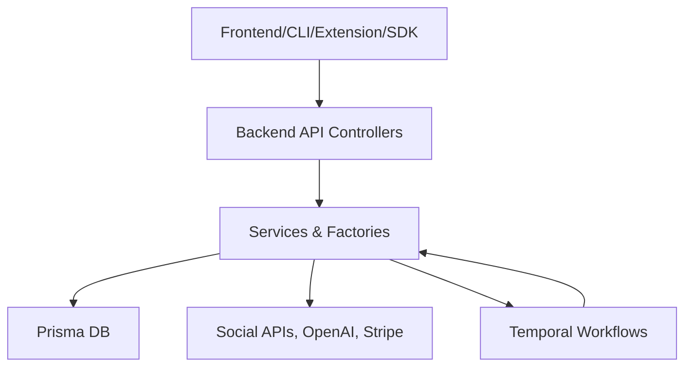
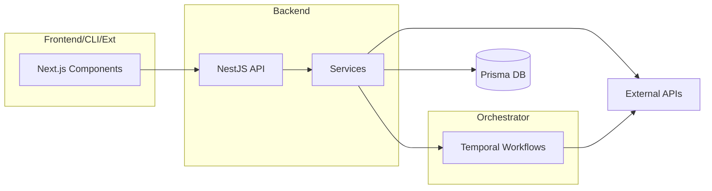

## Architecture Notes

The system is assembled as a modular monorepo using Turborepo (inferred from structure), comprising distinct applications for frontend, backend API, CLI, SDK, browser extension, workflow orchestrator, and command-line tasks. Shared libraries (`libraries/nestjs-libraries`, `libraries/react-shared-libraries`, `libraries/helpers`) centralize cross-cutting concerns like database access, social integrations, AI agents, video processing, and utilities. This design emerged from the need to support multi-platform content posting ("robo-multipost") with AI-driven automation, handling synchronous API requests and asynchronous workflows. NestJS powers server-side apps for type safety and modularity, Prisma for ORM, Temporal for durable workflows (e.g., autoposting streaks), and Next.js for the frontend. The structure prioritizes separation of concerns, extensibility via provider factories, and scalability through independent deployments, evolving from a monolithic backend to distributed orchestration to manage high-volume social media interactions and AI graph executions.

## System Architecture Overview

The system is a **modular monolith in a monorepo**, with loosely coupled micro-apps deployable independently (e.g., via Docker Compose). Core topology includes:

- **Client-facing apps** (frontend, CLI, SDK, extension): Handle user input, auth, and integrations.
- **Backend API** (`apps/backend`): REST/GraphQL gateway for CRUD, auth, and analytics.
- **Orchestrator** (`apps/orchestrator`): Temporal-based workflow engine for async tasks like autoposting and email campaigns.
- **Shared services**: Database (Prisma/Postgres), storage (Cloudflare R2), caching (Redis), queues (Temporal).

Requests traverse: **Client → Backend Controllers → Services → Repositories/Integrations → External APIs/DB**. Control pivots at service layers (business logic) and Temporal workflows (async pivots). Deployment model: Containerized services with `docker-compose.yaml` for dev/prod, supporting horizontal scaling of backend/orchestrator.

## Architectural Layers

- **Config**: Environment and runtime configuration (`.`, `apps/sdk`, `apps/extension`, `apps/cli/src`).
- **Controllers**: HTTP/CLI entrypoints and routing (`apps/cli/src`, `apps/backend/src/public-api`, `apps/backend/src/api/routes`).
- **Utils**: Cross-cutting helpers, decorators, translation, Sentry (`libraries/react-shared-libraries/src/*`, `libraries/nestjs-libraries/src/utils/*`, `libraries/helpers/src/*`).
- **Services**: Business orchestration, integrations, AI agents (`libraries/nestjs-libraries/src/services`, `libraries/nestjs-libraries/src/integrations`, `libraries/nestjs-libraries/src/agent`).
- **Models**: Domain types, DTOs, interfaces (`libraries/nestjs-libraries/src/dtos/*`, `libraries/nestjs-libraries/src/chat`).
- **Repositories**: Data persistence abstractions (`libraries/nestjs-libraries/src/database/prisma/*`).
- **Components**: React/Next.js UI (`apps/frontend/src/components/*`, `apps/frontend/src/app/(app)/*`).

> See [`codebase-map.json`](./codebase-map.json) for complete symbol counts and dependency graphs.

## Detected Design Patterns

| Pattern | Confidence | Locations | Description |
|---------|------------|-----------|-------------|
| Factory | 95% | [`UploadFactory`](../libraries/nestjs-libraries/src/upload/upload.factory.ts), [`IntegrationManager`](../libraries/nestjs-libraries/src/integrations/integration.manager.ts) | Abstracts provider instantiation (e.g., storage, social integrations) for extensibility. |
| Repository | 90% | [`AgenciesRepository`](../libraries/nestjs-libraries/src/database/prisma/agencies/agencies.repository.ts), all `*.repository.ts` | Encapsulates Prisma queries, enabling mock/test swapping. |
| Service Layer | 90% | [`AgentGraphService`](../libraries/nestjs-libraries/src/agent/agent.graph.service.ts), [`OpenaiService`](../libraries/nestjs-libraries/src/openai/openai.service.ts) | Centralizes domain logic, injected via NestJS DI. |
| Module (NestJS) | 95% | [`AppModule`](../apps/backend/src/app.module.ts), [`AgentModule`](../libraries/nestjs-libraries/src/agent/agent.module.ts) | Organizes providers, controllers, and exports for composition. |
| Workflow (Temporal) | 85% | [`autoPostWorkflow`](../apps/orchestrator/src/workflows/autopost.workflow.ts), [`streakWorkflow`](../apps/orchestrator/src/workflows/streak.workflow.ts) | Durable execution for long-running tasks like multi-platform posting. |
| Decorator | 80% | [`@PostPlug()`](../libraries/helpers/src/decorators/post.plug.ts), `@Tool()` | Metadata-driven extensions (e.g., chat tools, plugs). |

## Entry Points

- [`apps/sdk/src/index.ts`](../apps/sdk/src/index.ts) - SDK bootstrap (`Postiz` class).
- [`apps/extension/src/background.ts`](../apps/extension/src/background.ts) - Browser extension runtime.
- [`apps/cli/src/index.ts`](../apps/cli/src/index.ts) - CLI API client.
- [`apps/frontend/src/app/layout.tsx`](../apps/frontend/src/app/layout.tsx) - Frontend root layout.
- [`apps/backend/src/main.ts`](../apps/backend/src/main.ts) - Backend server start.
- [`apps/orchestrator/src/main.ts`](../apps/orchestrator/src/main.ts) - Temporal worker bootstrap.
- [`apps/commands/src/main.ts`](../apps/commands/src/main.ts) - Command tasks entry.

## Public API

| Symbol | Type | Location |
|--------|------|----------|
| `Postiz` | class | apps/sdk/src/index.ts:15 |
| `AppModule` | class | apps/backend/src/app.module.ts:61 |
| `AbilityPolicy` | type | apps/backend/src/services/auth/permissions/permissions.ability.ts:5 |
| `abortMultipartUpload` | function | libraries/nestjs-libraries/src/upload/r2.uploader.ts:187 |
| `AgentGraphService` | class | libraries/nestjs-libraries/src/agent/agent.graph.service.ts:105 |
| `AuthService` | class | apps/backend/src/services/auth/auth.service.ts:16 |
| `AutopostService` | class | libraries/nestjs-libraries/src/database/prisma/autopost/autopost.service.ts:62 |
| `autoPostWorkflow` | function | apps/orchestrator/src/workflows/autopost.workflow.ts:14 |
| `UploadFactory` | class | libraries/nestjs-libraries/src/upload/upload.factory.ts:5 |
| `OpenaiService` | class | libraries/nestjs-libraries/src/openai/openai.service.ts:20 |

## Internal System Boundaries

Domains are bounded by NestJS modules and Prisma schemas: **Auth** (JWT/permissions via `AbilityPolicy`), **Integrations** (social providers in `libraries/nestjs-libraries/src/integrations/social`), **Agents** (`libraries/nestjs-libraries/src/agent`), **Autopost** (`libraries/nestjs-libraries/src/database/prisma/autopost`). Data ownership: User/org-scoped via Prisma relations. Synchronization: Temporal workflows poll/refresh integrations; Redis for short-lived state. Contracts enforced via DTOs (`libraries/nestjs-libraries/src/dtos/*`) and interfaces (e.g., `ISocialMediaIntegration`).

## External Service Dependencies

- **Social APIs** (LinkedIn, Bluesky, Instagram, etc.): OAuth2/refresh tokens; rate limits vary (e.g., LinkedIn: 1000/day); fallback to queues on 429s.
- **OpenAI/Fal.ai**: API keys; token-based billing; retries with exponential backoff.
- **Stripe**: Webhooks/API keys; idempotency for subscriptions.
- **Cloudflare R2**: Upload creds; multipart for large videos.
- **Temporal Cloud/Postgres/Redis**: Connection strings; durable persistence.
- **Resend/NodeMailer**: SMTP/API for emails; fallback chaining.
- **Prisma (Postgres)**: DB URL; migrations via CLI.

Failure handling: Circuit breakers in services, dead-letter queues in Temporal.

## Key Decisions & Trade-offs

- **Temporal over BullMQ**: Chosen for saga orchestration in multi-platform posts; trade-off: higher complexity vs. native retries.
- **Monorepo + Shared Libs**: Enables type-sharing/DX; vs. federation: simpler builds.
- **Provider Factories**: 50+ social integrations; extensible without core changes.
- **Prisma Repos**: Type-safe queries; vs. raw SQL: easier onboarding.
- Experiment: Graph-based agents (`AgentGraphService`) over linear chains for complex autoposting.

## Diagrams

See Mermaid overview above. Component diagram:

## Risks & Constraints

- **Rate Limits**: Social APIs cap bursts; mitigated by Temporal throttling.
- **AI Costs**: OpenAI token spend; monitor via `TrackService`.
- **Scaling**: Workflows stateful; shard by user/org.
- **Extension Security**: Cookie storage; encrypted, alarm-refreshed.
- Assumptions: Stable OAuth scopes; Postgres >=14.

## Top Directories Snapshot

- `apps/` (~10 subdirs, 200+ files): Independent applications (backend, frontend, cli, orchestrator, extension, sdk, commands).
- `libraries/` (~5 subdirs, 150+ files): Shared NestJS/React modules (nestjs-libraries, react-shared-libraries, helpers).
- `docs/` (~15 files): Documentation and guides.
- `packages/` (if present, configs/ESLint).
- `dynamicconfig/` (runtime configs).

## Related Resources

- [project-overview.md](./project-overview.md)
- [data-flow.md](./data-flow.md)
- [`codebase-map.json`](./codebase-map.json)
