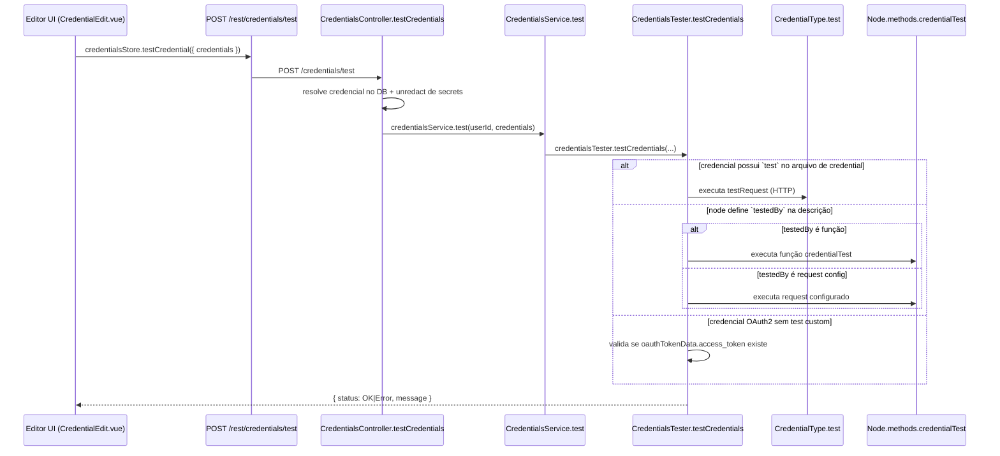

# Dossiê: validação de credenciais (Facebook, Instagram, TikTok, Pinterest, Twitter, Reddit, Discord, Slack, LinkedIn, Telegram, WordPress)

## 1) Fluxo geral da validação no n8n

Quando uma credencial é salva no editor, a validação passa por este fluxo:

### Paths principais desse fluxo

- UI salva e dispara reteste: `packages/frontend/editor-ui/src/features/credentials/components/CredentialEdit/CredentialEdit.vue`
- Chamada REST para teste: `packages/frontend/editor-ui/src/features/credentials/credentials.api.ts`
- Endpoint backend de teste: `packages/cli/src/credentials/credentials.controller.ts`
- Ponte para o serviço de teste: `packages/cli/src/credentials/credentials.service.ts`
- Resolução da estratégia de validação: `packages/cli/src/services/credentials-tester.service.ts`

## 2) Comportamento importante: OAuth vs não-OAuth

- Para credenciais **OAuth1/OAuth2** (`isOAuthType`), o `saveCredential()` **não** chama o teste automático após salvar.
- Para credenciais **não OAuth** e testáveis, `saveCredential()` chama `testCredential()` depois do `create/update`.

Na prática, credenciais OAuth costumam ser validadas no fluxo de autorização (callback/token), e no tester há fallback OAuth2 que só verifica presença de `oauthTokenData.access_token` quando não existe `test` ou `testedBy` específico.

## 3) Dossiê por plataforma

## Facebook

### Credenciais relacionadas

1. `facebookGraphApi`  
   Path: `packages/nodes-base/credentials/FacebookGraphApi.credentials.ts`
   - Possui `test` nativo.
   - Request de teste: `GET https://graph.facebook.com/v8.0/me`.

2. `facebookGraphAppApi`  
   Path: `packages/nodes-base/credentials/FacebookGraphAppApi.credentials.ts`
   - `extends = ['facebookGraphApi']`.
   - Não redefine `test`, então herda o comportamento base do tipo pai.

3. `facebookLeadAdsOAuth2Api`  
   Path: `packages/nodes-base/credentials/FacebookLeadAdsOAuth2Api.credentials.ts`
   - OAuth2 (`extends = ['oAuth2Api']`).
   - Sem `test` explícito no arquivo da credencial.
   - Usa fallback OAuth2 no tester quando não houver `testedBy` custom.

## Instagram

- Não há credential dedicada com nome `instagram*` em `packages/nodes-base/credentials`.
- A integração de Instagram no contexto Meta/Facebook tende a usar credenciais Facebook Graph/Facebook App (ex.: recursos de Instagram no node Facebook), então a validação recai no mesmo mecanismo dessas credenciais.

## TikTok

- Não há credential dedicada com nome `tiktok*` em `packages/nodes-base/credentials`.
- Portanto não existe, neste pacote base, fluxo próprio de `test` para credencial TikTok.

## Pinterest

- Não há credential dedicada com nome `pinterest*` em `packages/nodes-base/credentials`.
- Portanto não existe, neste pacote base, fluxo próprio de `test` para credencial Pinterest.

## Twitter (X)

### Credenciais relacionadas

1. `twitterOAuth1Api`  
   Path: `packages/nodes-base/credentials/TwitterOAuth1Api.credentials.ts`
   - OAuth1 (`extends = ['oAuth1Api']`).
   - Sem `test` explícito no arquivo da credencial.

2. `twitterOAuth2Api`  
   Path: `packages/nodes-base/credentials/TwitterOAuth2Api.credentials.ts`
   - OAuth2 (`extends = ['oAuth2Api']`).
   - Sem `test` explícito no arquivo da credencial.
   - Em ausência de `testedBy`, cai no fallback OAuth2 (`oauthTokenData.access_token`).

## Reddit

- `redditOAuth2Api`  
  Path: `packages/nodes-base/credentials/RedditOAuth2Api.credentials.ts`
  - OAuth2 (`extends = ['oAuth2Api']`).
  - Sem `test` explícito no arquivo da credencial.
  - Em ausência de `testedBy`, cai no fallback OAuth2.

## Discord

### Credenciais relacionadas

1. `discordBotApi`  
   Path: `packages/nodes-base/credentials/DiscordBotApi.credentials.ts`
   - Possui `test` nativo.
   - Request de teste: `GET https://discord.com/api/v10/users/@me`.

2. `discordWebhookApi`  
   Path: `packages/nodes-base/credentials/DiscordWebhookApi.credentials.ts`
   - Possui `test` nativo.
   - Request de teste usa a URL do webhook (`{{$credentials.webhookUri}}`).

3. `discordOAuth2Api`  
   Path: `packages/nodes-base/credentials/DiscordOAuth2Api.credentials.ts`
   - OAuth2 (`extends = ['oAuth2Api']`).
   - Sem `test` explícito no arquivo da credencial.
   - Em ausência de `testedBy`, cai no fallback OAuth2.

## Slack

### Credenciais relacionadas

1. `slackApi`  
   Path: `packages/nodes-base/credentials/SlackApi.credentials.ts`
   - Possui `test` nativo.
   - Request de teste: `GET https://slack.com/api/users.profile.get`.
   - Possui regra `responseSuccessBody` para marcar erro com mensagem amigável em `invalid_auth`.

2. `slackOAuth2Api`  
   Path: `packages/nodes-base/credentials/SlackOAuth2Api.credentials.ts`
   - OAuth2 (`extends = ['oAuth2Api']`).
   - Sem `test` explícito no arquivo da credencial.
   - Em ausência de `testedBy`, cai no fallback OAuth2.

## LinkedIn

### Credenciais relacionadas

1. `linkedInOAuth2Api`  
   Path: `packages/nodes-base/credentials/LinkedInOAuth2Api.credentials.ts`
   - OAuth2 (`extends = ['oAuth2Api']`).
   - Sem `test` explícito no arquivo da credencial.

2. `linkedInCommunityManagementOAuth2Api`  
   Path: `packages/nodes-base/credentials/LinkedInCommunityManagementOAuth2Api.credentials.ts`
   - OAuth2 (`extends = ['oAuth2Api']`).
   - Sem `test` explícito no arquivo da credencial.

Ambas seguem fallback OAuth2 quando não houver `testedBy` específico no node.

## Telegram

- `telegramApi`  
  Path: `packages/nodes-base/credentials/TelegramApi.credentials.ts`
  - Possui `test` nativo.
  - Request de teste: `GET {{$credentials.baseUrl}}/bot{{$credentials.accessToken}}/getMe`.

## WordPress

- `wordpressApi`  
  Path: `packages/nodes-base/credentials/WordpressApi.credentials.ts`
  - Possui `authenticate` via basic auth (username/password).
  - Possui `test` nativo.
  - Request de teste: `GET {{$credentials.url}}/wp-json/wp/v2/users`.
  - Suporta `skipSslCertificateValidation` baseado em `allowUnauthorizedCerts`.

## 4) O que exatamente é chamado no backend durante o teste

1. `POST /credentials/test` recebe `{ credentials }`.
2. Controller busca a credencial persistida para o usuário (`findCredentialForUser`) e faz merge/unredact para restaurar secrets mascarados.
3. `credentialsService.test(userId, credentials)` delega para `credentialsTester.testCredentials`.
4. `credentialsTester.getCredentialTestFunction` escolhe a estratégia:
   - `credentialType.test` (request de teste definido na credencial), ou
   - `testedBy` definido no node (função ou request), ou
   - fallback OAuth2 (`oauthTokenData.access_token`).
5. Resultado final retorna como `INodeCredentialTestResult` para a UI.

## 5) Observação prática para seu caso (Facebook)

No caso do **Facebook Graph API** (não OAuth), após salvar a credencial no modal, o editor executa teste automático (quando testável) e o backend chama o `test.request` da credencial (`/me` no Graph API), retornando `OK`/`Error` com mensagem.
